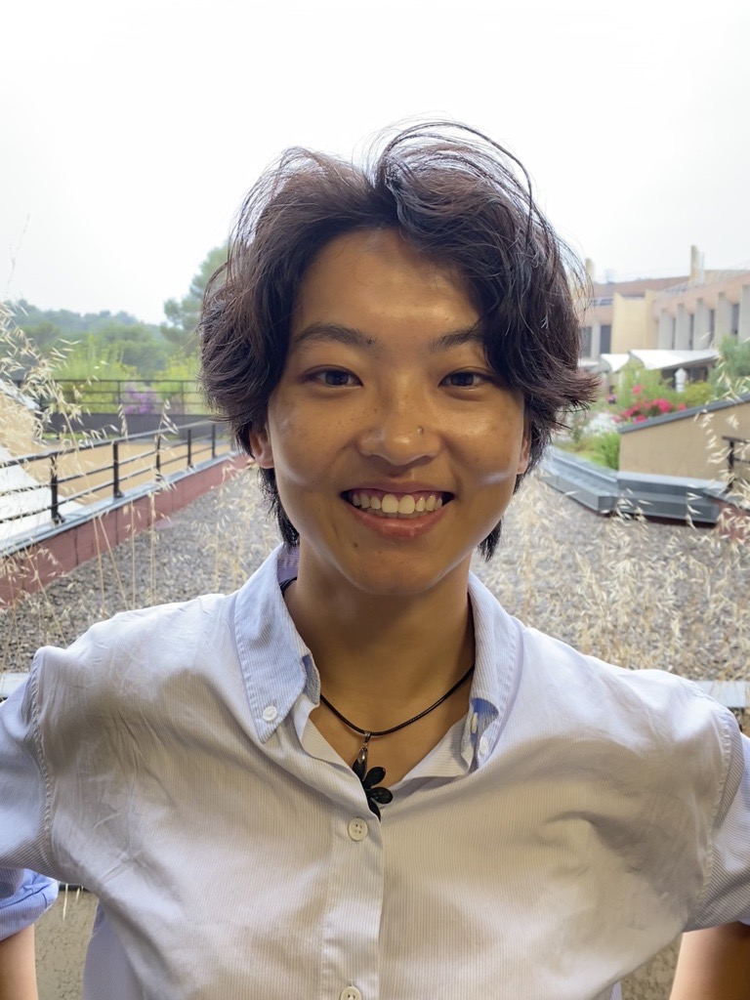

::: {.intro}
{alt="Portrait of Your Name"}

::: {}
[I am a PhD candidate in finance at University, where I study capital
allocation under information asymmetry. My current work asks how investors
value intermediaries when firm fundamentals are unobservable, using the
market for blank-cheque acquisition companies as a setting.]{.lead}

[Before the PhD I worked in X. I hold an MSc in Y from Z.]{}

[name@university.edu &nbsp;·&nbsp; Department of Finance, University]{.meta}
:::
:::

## research

I work on corporate finance and financial intermediation, with an empirical
focus on hand-collected contract data. Recent projects examine sponsor
commitment mechanisms and reputation in SPAC markets.

[See all papers →](research.qmd)

## teaching

Teaching assistant, Corporate Finance (undergraduate), 2025–26.
